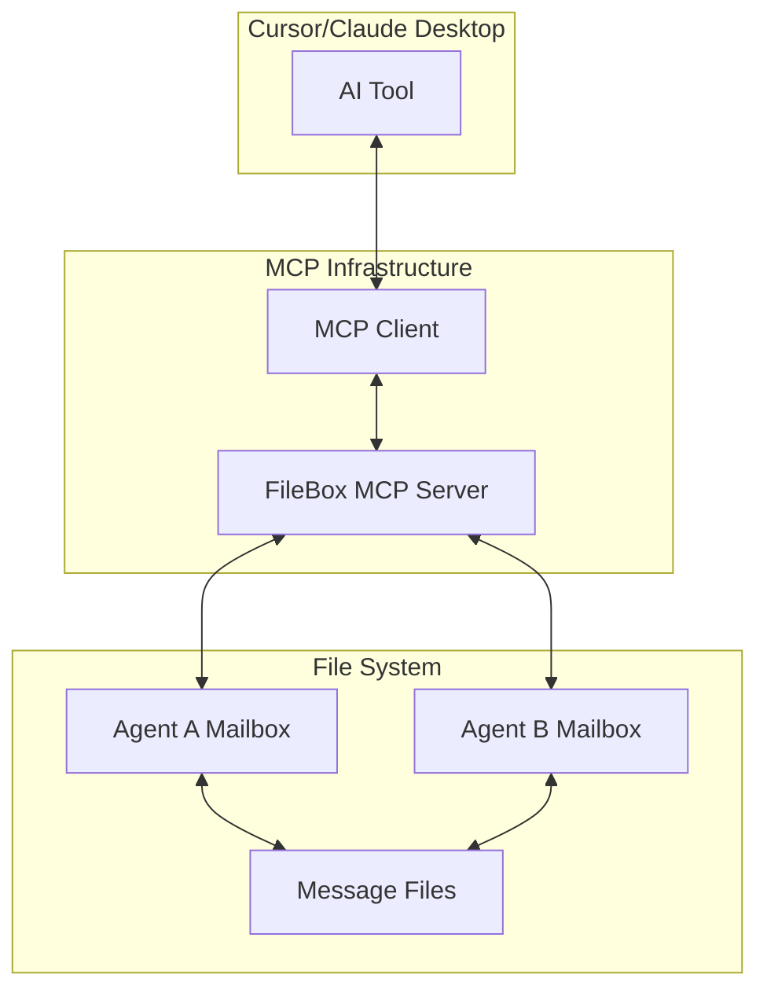
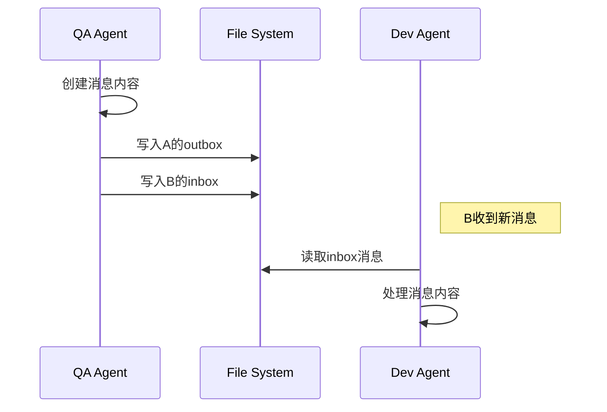
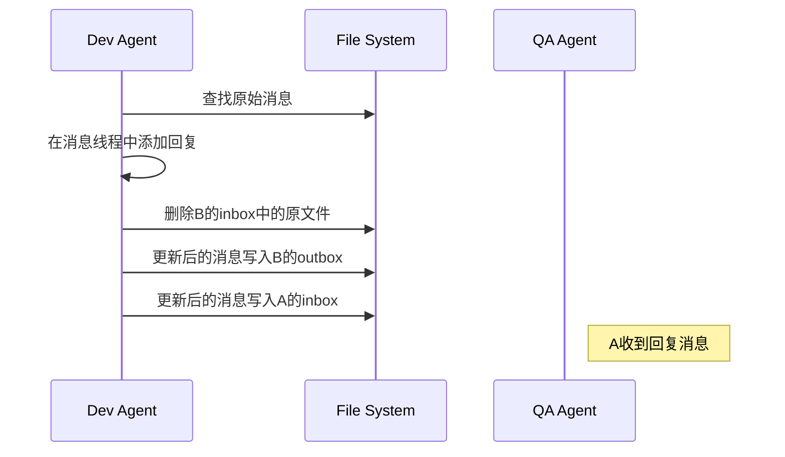

# FileBox MCP：基于文件系统的AI Agent消息传递系统

## 1. 引言

随着AI工具在软件开发流程中的深入应用，不同AI工具之间进行高效、结构化的通信变得至关重要。当前，AI工具之间的协作往往缺乏统一的机制，导致信息传递不畅、问题跟踪困难、需求管理混乱。

基于Model Context Protocol (MCP) 规范，我们实现了一个**基于文件系统的AI Agent消息传递系统**。本系统通过MCP服务器的方式，为AI工具提供标准化的消息传递工具，实现不同AI代理之间的结构化通信。

与传统的网络通信方式不同，本系统利用文件系统作为消息的传输和存储介质，每个AI代理通过MCP工具进行消息的发送、接收和管理，形成了一个去中心化的邮件线程式通信系统。

## 2. 系统架构

### 2.1 MCP服务器架构

FileBox MCP采用标准的MCP服务器架构，通过stdio方式与宿主AI工具（如Cursor）进行通信：



### 2.2 核心组件

- **MCP服务器**：基于FastMCP框架实现的标准MCP服务器
- **FileBox服务**：核心业务逻辑，负责消息的创建、发送、接收和管理
- **邮箱系统**：基于文件系统的消息存储和管理机制
- **MCP工具**：暴露给AI工具的标准化接口

### 2.3 配置系统

FileBox MCP的配置分为两部分：

**统一配置文件 (`.filebox`)**: 这是一个JSON格式的配置文件，放置在每个项目的根目录下，用于定义当前项目的代理身份和所有参与通信的代理及其项目根目录。

```json
{
    "current_agent": "qa_agent",
    "agents": {
        "qa_agent": "/path/to/qa_repo_root",
        "frontend_agent": "/path/to/frontend_repo_root",
        "dev_agent": "/path/to/dev_repo_root"
    }
}
```

**配置字段说明：**
*   `current_agent`: 当前项目对应的代理ID，必须与`agents`配置中定义的代理ID之一匹配
*   `agents`: 一个对象，键是代理ID（例如`qa_agent`），值是该代理所在项目的根目录的绝对路径

**注意事项：**
*   MCP Server启动时会加载此文件，因此路径必须正确且可访问
*   MCP Server在处理消息时，会读取当前工作目录的`.filebox`文件来确定自身身份
*   所有参与通信的代理都必须在`agents`配置中定义

## 3. 邮箱系统设计

### 3.1 目录结构

每个代理的邮箱都统一存放在其项目根目录下的`docs/mailbox/`目录中，并采用标准的子目录结构：

```
<repo_root>/docs/mailbox/
├── inbox/          # 收件箱 - 接收到的新消息
├── outbox/         # 发件箱 - 已发送的消息副本
├── done/           # 已完成 - 处理完成的消息
└── cancel/         # 已取消 - 拒绝或取消的消息
```
*   `<repo_root>`: 指的是代理所在项目的根目录，由`.filebox`配置文件中的`agents`字段配置。
*   **注意**: 确保每个代理的项目根目录下存在`docs/mailbox/`及其子目录。

### 3.2 消息文件格式

消息以Markdown文件形式存储，采用邮件线程格式：

```markdown
# BR: 消息标题

**Format Version:** 1.0
**Message ID:** uuid
**Sender:** sender_agent_id
**Receiver:** receiver_agent_id
**Timestamp:** ISO8601时间戳
**Original Sender:** original_sender_id
**Current Owner:** current_owner_id

===== MESSAGE THREAD =====

━━━━━━━━━━━━━━━━━━━━━━━━━━━━━━━━━━━━━━━━━━━━━━━━━━━━━━━━━━━━━━━━━━━━━━━━━━━━━━━━━━━━━━━━━━━━━━━━━━━━━━

## 2025-06-30T08:25:15.890Z - dev_agent to qa_agent (ACK)

最新回复内容...

━━━━━━━━━━━━━━━━━━━━━━━━━━━━━━━━━━━━━━━━━━━━━━━━━━━━━━━━━━━━━━━━━━━━━━━━━━━━━━━━━━━━━━━━━━━━━━━━━━━━━━

## 2025-06-30T08:15:22.616Z - qa_agent to dev_agent (BR)

原始消息内容...
```

### 3.3 文件命名规则

文件名格式：`YYYY-MM-DD_HHMM-TYPE-title-msgid.md`

- **时间戳**：`2025-06-30_0815` (精确到分钟)
- **消息类型**：保持原始发起者定义的类型
- **标题**：消息标题的slug格式
- **消息ID**：UUID的前8位

示例：`2025-06-30_0815-BR-api-performance-issue-1b1d8fc0.md`

### 3.4 关键设计特性

1. **强分割符**：使用 `━━━` 分割线明确区分不同的消息回复
2. **固定文件名**：回复时不改变文件名，直接覆盖原文件
3. **邮件线程格式**：最新消息在前，保持时间顺序
4. **元数据分离**：使用 `===== MESSAGE THREAD =====` 分隔元数据和消息内容

## 4. MCP工具接口

FileBox MCP提供以下标准化工具：

### 4.1 filebox_send_message

发送消息给其他代理。

**参数：**
- `receiver_id` (必需): 接收者代理ID
- `msg_type` (必需): 消息类型 (BR, ACK, ER, INFO, URGENT)
- `title` (必需): 消息标题
- `content` (必需): 消息内容
- `original_message_id` (可选): 回复的原始消息ID
- `runAs` (可选): 指定发送者代理ID（覆盖默认的当前代理）

**功能：**
- 发送新消息：创建新的消息文件并发送给目标代理
- 回复消息：在原消息线程中添加回复内容
- 代理切换：使用runAs参数以指定代理身份发送消息

### 4.2 filebox_list_messages

列出指定邮箱中的消息。

**参数：**
- `box_type` (必需): 邮箱类型 (inbox, outbox, done, cancel)
- `runAs` (可选): 指定代理ID（覆盖默认的当前代理）

**返回：**
消息文件名列表

### 4.3 filebox_read_message

读取消息内容。

**参数：**
- `box_type` (必需): 邮箱类型
- `filename` (必需): 消息文件名
- `runAs` (可选): 指定代理ID（覆盖默认的当前代理）

**返回：**
完整的消息内容（Markdown格式）

### 4.4 filebox_resolve_message

标记消息为已解决。

**参数：**
- `filename` (必需): 消息文件名
- `runAs` (可选): 指定代理ID（覆盖默认的当前代理）

**功能：**
将消息从inbox移动到done目录

### 4.5 filebox_reject_message

拒绝消息。

**参数：**
- `filename` (必需): 消息文件名
- `runAs` (可选): 指定代理ID（覆盖默认的当前代理）

**功能：**
将消息从inbox移动到cancel目录

### 4.6 runAs参数详解

所有MCP工具都支持可选的`runAs`参数，实现动态代理身份切换：

#### 使用场景

1. **多代理单仓库**：一个项目包含多个团队（QA、Frontend、Backend）
2. **跨角色协作**：AI需要在不同角色间切换处理任务
3. **测试场景**：模拟多代理交互

#### 配置示例

```json
{
    "current_agent": "qa_agent",
    "agents": {
        "qa_agent": "/path/to/shared_repo",
        "frontend_agent": "/path/to/shared_repo", 
        "backend_agent": "/path/to/shared_repo"
    }
}
```

#### 邮箱目录自动分离

当检测到多个代理共享同一项目根路径时，系统自动创建代理专用邮箱：

```
shared_repo/docs/mailbox/
├── qa_agent/
│   ├── inbox/
│   ├── outbox/
│   ├── done/
│   └── cancel/
├── frontend_agent/
│   ├── inbox/
│   ├── outbox/
│   ├── done/
│   └── cancel/
└── backend_agent/
    ├── inbox/
    ├── outbox/
    ├── done/
    └── cancel/
```

#### 错误处理

- 如果`runAs`指定的代理ID不存在于配置中，会抛出详细错误信息
- 错误信息包含所有可用的代理ID列表

## 5. 消息流转机制

### 5.1 消息发送流程



### 5.2 消息回复流程



### 5.3 消息处理流程

1. **接收**：消息出现在代理的inbox目录
2. **处理**：代理读取并处理消息内容
3. **回复**：可选的回复操作，更新消息线程
4. **完成**：标记为resolved（移至done）或reject（移至cancel）

## 6. 消息类型系统

| 类型 | 全称 | 说明 | 使用场景 |
|------|------|------|----------|
| BR | Bug Report | 错误报告 | QA发现问题时使用 |
| ACK | Acknowledgment | 确认回复 | 确认收到消息并开始处理 |
| ER | Enhancement Request | 功能增强请求 | 提出新功能需求 |
| INFO | Information | 信息通知 | 一般信息分享 |
| URGENT | Urgent | 紧急消息 | 需要立即处理的问题 |

## 7. 部署和配置

### 7.1 MCP配置

在MCP配置文件（如`~/.cursor/mcp.json`）中添加FileBox MCP Server的配置。请确保`command`和`args`指向正确的`bun`可执行文件和`src/index.ts`路径。

```json
{
  "mcpServers": {
    "FileBox-Server": {
      "command": "/path/to/bun",
      "type": "stdio",
      "args": ["/path/to/filebox-mcp/src/index.ts"],
      "autoApprove": [
        "filebox_send_message",
        "filebox_list_messages",
        "filebox_read_message",
        "filebox_resolve_message",
        "filebox_reject_message"
      ]
    }
  }
}
```
*   **注意**: `env`字段不再需要`FILEBOX_CONFIG`，因为代理配置将通过`.filebox`文件加载。

### 7.2 构建和启动

```bash
# 安装依赖
npm install

# 构建项目
npm run build

# 创建邮箱目录
mkdir -p /tmp/qa_agent_mailbox/{inbox,outbox,done,cancel}
mkdir -p /tmp/dev_agent_mailbox/{inbox,outbox,done,cancel}

# 重启AI工具以加载MCP服务器
```

## 8. 技术实现

### 8.1 技术栈

- **运行时**：Bun.js
- **MCP框架**：FastMCP
- **语言**：TypeScript
- **存储**：文件系统（Markdown文件）
- **通信**：MCP stdio协议

### 8.2 核心模块

- `src/core/filebox.ts` - 核心FileBox服务实现
- `src/core/tools.ts` - MCP工具定义
- `src/server/server.ts` - MCP服务器启动逻辑
- `src/index.ts` - 应用入口点

### 8.3 关键特性

1. **单一实例架构**：一个MCP服务器实例可服务于多个代理。
2. **本地化配置**：通过`.filebox`文件在项目根目录识别当前代理身份。
3. **文件系统同步**：直接文件操作确保消息传递的可靠性。
4. **Markdown格式**：人类可读的消息格式。

## 9. 使用示例

### 9.1 发送Bug报告

```javascript
await filebox_send_message({
    receiver_id: "dev_agent",
    msg_type: "BR",
    title: "登录页面验证码显示异常",
    content: `在Chrome浏览器中发现验证码图片无法正常显示。

**复现步骤：**
1. 打开登录页面
2. 点击验证码图片
3. 验证码不刷新

**环境信息：**
- 浏览器：Chrome 120.0.6099.129
- 操作系统：macOS 14.2.1`
});
```

### 9.2 回复确认

```javascript
await filebox_send_message({
    receiver_id: "qa_agent",
    msg_type: "ACK",
    title: "登录页面验证码显示异常",
    content: `已确认问题，开始修复。

**修复计划：**
1. 检查验证码服务日志
2. 更新前端缓存策略
3. 测试验证

**预计修复时间：** 2小时内`,
    original_message_id: "1b1d8fc0-034e-4fd4-874b-a8d39f95ba68"
});
```

## 10. 优势和特点

### 10.1 设计优势

1. **简单性**：基于文件系统，无需复杂的网络协议
2. **可追溯性**：完整的消息历史记录
3. **可读性**：人类可读的Markdown格式
4. **标准化**：基于MCP协议的标准化接口
5. **去中心化**：无需中央服务器

### 10.2 实用特性

1. **邮件线程格式**：类似邮件的对话历史
2. **强分割符**：清晰的消息边界
3. **文件名保持**：回复时不改变文件名
4. **自动化处理**：支持消息状态管理

## 11. 限制和注意事项

### 11.1 当前限制

1. **单机部署**：目前仅支持同一文件系统上的代理通信。
2. **文件锁定**：并发访问可能导致文件冲突。

### 11.2 最佳实践

1. **重启要求**：代码修改后需要重新构建并重启AI工具
2. **路径配置**：确保所有代理使用一致的邮箱路径配置
3. **权限管理**：确保文件系统权限正确设置

## 12. 未来改进

### 12.1 短期改进

1. **错误处理**：增强文件操作的错误处理机制
2. **并发控制**：实现文件锁定机制防止冲突
3. **消息搜索**：增加消息内容搜索功能

### 12.2 长期规划

1. **网络支持**：支持跨网络的代理通信
2. **消息加密**：增加消息内容加密功能
3. **Web界面**：提供Web界面进行消息管理
4. **插件系统**：支持自定义消息处理插件

## 13. 实现细节

### 13.1 消息文件处理

- **新消息创建**：生成UUID作为消息ID，创建新的Markdown文件
- **回复处理**：查找原始消息，在线程前端添加新回复内容
- **文件覆盖**：回复时使用原始文件名，实现无缝更新
- **状态管理**：通过文件移动实现消息状态变更

### 13.2 错误处理机制

- **文件不存在**：优雅处理文件读取失败
- **权限错误**：处理文件系统权限问题
- **格式错误**：处理消息格式解析错误
- **配置错误**：验证MCP配置的正确性

### 13.3 性能考虑

- **文件缓存**：避免重复读取同一文件
- **目录监控**：可选的文件系统事件监控
- **批量操作**：支持批量消息处理
- **内存管理**：合理控制内存使用

## 14. 总结

FileBox MCP成功实现了基于文件系统的AI代理消息传递系统，通过标准的MCP协议为AI工具提供了结构化的通信能力。系统采用邮件线程格式，支持消息的发送、回复、处理和状态管理，为AI工具间的协作提供了可靠的基础设施。

### 14.1 关键成就

1. **标准化接口**：基于MCP协议实现标准化的消息传递工具
2. **邮件线程格式**：创新的消息格式设计，支持清晰的对话历史
3. **文件系统集成**：简单可靠的文件系统存储机制
4. **实例化架构**：灵活的多代理支持架构

### 14.2 技术价值

FileBox MCP证明了文件系统作为AI代理通信介质的可行性，其简单性和可靠性为AI工具间的协作提供了新的思路。虽然当前实现相对简单，但其设计理念和架构为未来的扩展和改进奠定了良好的基础。

通过持续的迭代和优化，FileBox MCP有望成为AI工具生态系统中重要的通信基础设施，推动AI辅助开发的进一步发展。
