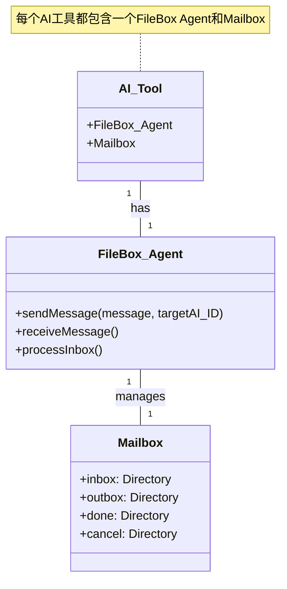
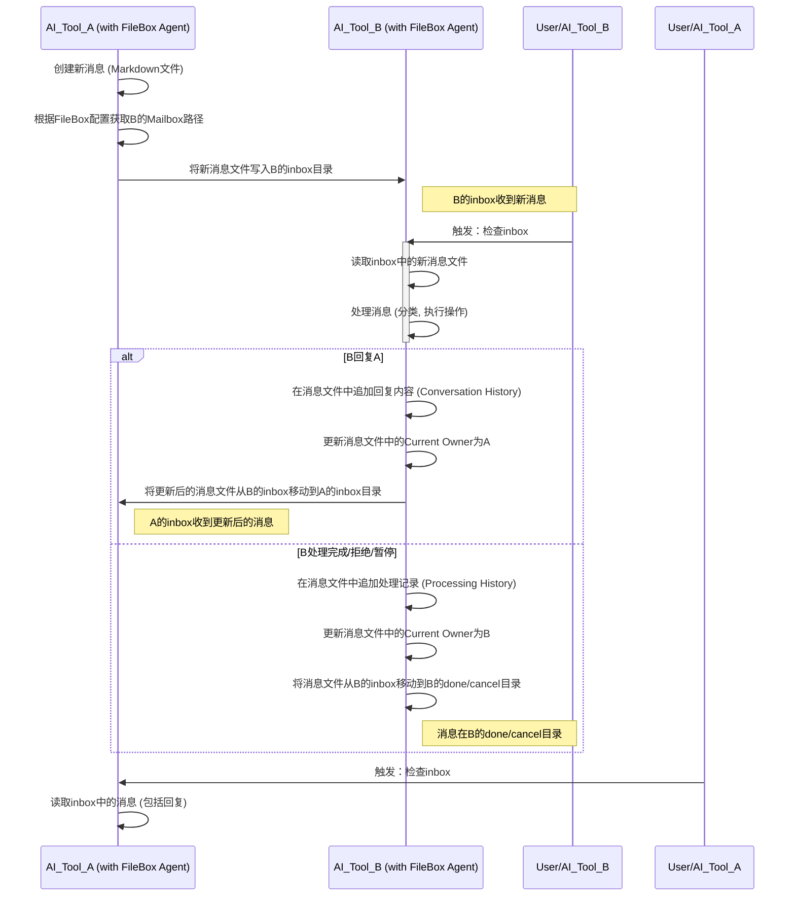

# FileBox MCP：基于文件系统的轻量级AI Agent消息传递系统

## 1. 引言

随着AI工具在软件开发流程中的深入应用，不同AI工具之间进行高效、结构化的通信变得至关重要。当前，AI工具之间的协作往往缺乏统一的机制，导致信息传递不畅、问题跟踪困难、需求管理混乱。

受Model Context Protocol (MCP) 中Agent间通信理念的启发，我们提出并设计一个**基于文件系统的AI Agent消息传递系统**。本系统旨在建立一个去中心化的通信机制，允许不同的AI工具通过共享文件系统进行结构化的消息交换，从而促进AI工具之间的协同工作，提升开发效率和质量。

与标准MCP协议（其核心是JSON-RPC over stdio或其他网络传输）不同，本系统专注于利用文件系统作为消息的传输和存储介质，以实现最简化的POC和快速迭代。每个AI工具将集成一个**FileBox Agent**。这个FileBox Agent是一个独立的程序，它**不会直接由用户通过命令行交互**，而是**由宿主AI开发工具（如Claude Desktop, Cursor等）在后台调用**，负责管理其本地的"邮箱"（Mailbox）并直接读写其他AI工具的Mailbox目录，从而实现AI工具间的通信。

## 2. 目标

FileBox MCP 的主要目标是：

*   **标准化通信**：为AI工具之间提供统一的通信协议和接口，确保信息传递的准确性和一致性。
*   **结构化信息**：支持AI工具以结构化的方式（如Enhancement Request, Bug Report, Discussion等）进行信息交换，便于自动化处理和分析。
*   **可追溯性**：记录所有通信历史，确保每个请求、问题和讨论都可追溯，便于审计和问题复盘。
*   **自动化处理**：结合AI工具的知识库和规则引擎，实现对接收到的请求进行自动化分类、处理和状态更新。
*   **知识沉淀**：将通信内容作为AI工具知识库的一部分，通过搜索和分析，提升AI工具的智能水平和问题解决能力。

## 3. 概念设计

FileBox MCP 的核心概念是每个AI工具都运行一个独立的程序（FileBox Agent），并通过文件系统进行通信。每个AI工具都拥有一个"邮箱"（Mailbox），用于接收、处理和发送消息。

### 3.1 核心组件

*   **FileBox Agent**：集成在每个AI工具内部的程序（由宿主AI开发工具调用），负责管理其本地的Mailbox，并根据配置直接读写其他AI工具的Mailbox目录以进行消息交换。
*   **Mailbox**：每个AI工具在本地文件系统上维护的特定目录结构，用于存储接收到的消息、已发送的消息以及处理状态。

### 3.2 Mailbox 结构

每个AI工具的 Mailbox 将采用以下目录结构（例如：`boom-ui/docs/mailbox`）：

```
mailbox/
├── inbox/       # 接收到的新消息
├── outbox/      # 已发送的消息（可选，用于记录）
├── done/        # 已处理完成的消息
└── cancel/      # 已取消或不予处理的消息
```

### 3.3 消息类型

FileBox MCP 将支持以下主要消息类型：

*   **Enhancement Request (ER)**：功能增强请求，例如 `boom-ui/tests/docs/QA自动化测试操作规程.md` 中描述的QA工程师提出的ER。
*   **Bug Report (BR)**：缺陷报告。
*   **Discussion (DIS)**：通用讨论或咨询。
*   **Acknowledgement (ACK)**：消息确认。
*   **Status Update (SU)**：状态更新。

每种消息类型都将有预定义的结构和字段，以确保信息的完整性和可解析性。

### 3.4 系统架构图

以下是两个AI工具通过FileBox MCP进行通信的简化结构图：



### 3.5 消息流转序列图

以下是AI工具A向AI工具B发送消息并处理的序列图：



### 3.6 FileBox配置

每个FileBox Agent都需要一个配置文件，其中包含当前Agent的ID以及所有参与通信的AI工具的ID及其对应的Mailbox根目录路径。例如：

```json
{
    "current_agent_id": "AI_Tool_A",
    "agents": {
        "AI_Tool_A": {
            "mailbox_path": "/Users/xiaowei/Workspace/lead-123/boom-ui/docs/mailbox"
        },
        "AI_Tool_B": {
            "mailbox_path": "/path/to/AI_Tool_B/mailbox"
        },
        "AI_Tool_C": {
            "mailbox_path": "/path/to/AI_Tool_C/mailbox"
        }
    }
}
```

FileBox Agent 将根据此配置，直接将消息文件写入目标AI工具的 `inbox` 目录。

### 3.7 消息处理流程（以ER为例）

1.  **发送新消息**：
    *   AI工具 A（例如QA工具）的FileBox Agent 接收到发送新消息的指令（例如通过宿主工具调用 `send` 接口）。
    *   FileBox Agent A 生成新的消息文件（包含所有元数据和 `Original Request/Content`），并根据其配置，确定 AI 工具 B 的 Mailbox 的 `inbox` 目录路径。
    *   FileBox Agent A 将新消息文件写入 AI 工具 B 的 `inbox` 目录。
    *   同时，FileBox Agent A 将该消息文件的副本保存到自己的 `outbox` 目录。

2.  **接收与处理**：
    *   AI 工具 B 的 FileBox Agent 在接收到用户提示词触发或其内部逻辑判断需要时，会主动检查其本地 `inbox` 目录。
    *   当发现新的消息文件时，AI 工具 B 将读取该文件，并根据预设的规则（例如 `boom-ui/.cursor/rules/handle-incoming-enhancement-requests.mdc`）对消息进行分类和处理：
        *   **分类**：Bug, 小ER, 大ER, 不合理ER。
        *   **执行**：根据分类执行相应的操作（例如，对于 Bug 和小ER，直接进入开发流程；对于大ER，生成设计文档；对于不合理ER，进行拒绝并说明原因）。

3.  **回复消息**：
    *   如果 AI 工具 B 需要回复 AI 工具 A（例如通过宿主工具调用 `send --reply_to` 接口），FileBox Agent B 会在当前消息文件中追加回复内容到 `Conversation History` 部分。
    *   FileBox Agent B 更新消息文件中的 `Receiver` 为 AI 工具 A 的 ID，并更新 `Current Owner` 为 AI 工具 A 的 ID。
    *   FileBox Agent B 将修改后的消息文件从当前所在目录（例如 `inbox`）**移动**到 AI 工具 A 的 `inbox` 目录。

4.  **处理完成/拒绝/暂停**：
    *   当 AI 工具 B 完成对消息的处理（例如通过宿主工具调用 `resolved`, `reject`, `onhold` 接口），FileBox Agent B 会在当前消息文件中追加处理记录到 `Processing History` 部分。
    *   FileBox Agent B 更新消息文件中的 `Current Owner` 为 AI 工具 B 的 ID。
    *   FileBox Agent B 将消息文件从当前所在目录（例如 `inbox`）**移动**到其本地的 `done` 或 `cancel` 目录。

### 3.8 与知识库集成

Mailbox 目录将作为AI工具知识库的一部分。这意味着：

*   **可搜索性**：通过AI工具的搜索功能，可以方便地检索历史通信记录和处理结果。
*   **上下文理解**：AI工具在处理新任务时，可以参考历史通信记录，获取更丰富的上下文信息。
*   **学习与优化**：通过对大量通信数据的分析，可以优化AI工具的决策逻辑和自动化处理能力。

### 3.9 FileBox Agent 调用接口

为了方便宿主AI开发工具与FileBox Agent进行交互，FileBox Agent将提供以下接口（由宿主工具调用）：

*   **`list <mailbox_type>`**：列出当前AI工具Mailbox中指定类型（`inbox`, `done`, `outbox`, `cancel`）目录下的所有消息文件。
    *   **调用方式**：宿主工具调用FileBox Agent的`list`接口。
    *   **用法示例**：`filebox list inbox`
    *   **功能**：返回文件名、从文件名解析出的创建时间、消息类型和标题。
    *   **输出示例**：
        ```
        2025-06-27T153000 ER 新功能请求：用户管理模块增加批量导入功能 (20250627T153000-ER-new-feature-request-user-management-module-increase-batch-import-function-60bd0e69.md)
        ```

*   **`read <mailbox_type> <message_file_name>`**：读取指定Mailbox中消息文件的完整内容。
    *   **调用方式**：宿主工具调用FileBox Agent的`read`接口。
    *   **用法示例**：`filebox read inbox 20250627T153000-ER-new-feature-request-user-management-module-increase-batch-import-function-60bd0e69.md`
    *   **功能**：返回指定消息文件的全部Markdown内容。

*   **`send <target_ai_id> <message_type> <markdown_content> [--reply_to <original_message_id>]`**：向指定AI工具发送消息。
    *   **调用方式**：宿主工具调用FileBox Agent的`send`接口。
    *   **功能**：
        *   **发送新消息**（不带 `--reply_to`）：
            *   生成新的 `message_id` 和 `timestamp`。
            *   `Original Sender` 和 `Current Owner` 都设置为当前 AI 工具的 ID。
            *   创建新的 Markdown 文件，包含所有元数据和 `Original Request/Content`。
            *   将文件写入目标 AI 工具的 `inbox` 目录。
            *   将文件副本保存到当前 AI 工具的 `outbox` 目录。
        *   **发送回复**（带 `--reply_to <original_message_id>`）：
            *   FileBox Agent 会在自己的 Mailbox 中查找 `original_message_id` 对应的消息文件（可能在 `outbox`、`done` 或 `cancel` 目录）。
            *   读取该消息文件的内容。
            *   在 `Conversation History` 部分追加新的回复内容（包含当前时间戳、发送者、接收者和消息类型）。
            *   更新文件顶部的 `Receiver` 为 `target_ai_id`。
            *   更新 `Current Owner` 为 `target_ai_id`。
            *   将修改后的文件从当前所在目录**移动**到目标 AI 工具的 `inbox` 目录。
            *   **注意：** 在移动文件之前，发送方应在自己的 `outbox` 目录中保留一个完整的副本，以确保拥有完整的对话历史。

*   **`resolved <message_file_name> <resolution_details>`**：标记`inbox`中的消息为已解决。
    *   **调用方式**：宿主工具调用FileBox Agent的`resolved`接口。
    *   **功能**：
        *   读取 `inbox` 中指定的消息文件。
        *   在 `Processing History` 部分追加处理结果（包含时间戳、处理 AI 工具 ID 和 `resolution_details`）。
        *   更新 `Current Owner` 为当前 AI 工具的 ID。
        *   将文件从 `inbox` 目录**移动**到 `done` 目录。

*   **`reject <message_file_name> <reason>`**：标记`inbox`中的消息为已拒绝。
    *   **调用方式**：宿主工具调用FileBox Agent的`reject`接口。
    *   **功能**：
        *   读取 `inbox` 中指定的消息文件。
        *   在 `Processing History` 部分追加拒绝原因（包含时间戳、处理 AI 工具 ID 和 `reason`）。
        *   更新 `Current Owner` 为当前 AI 工具的 ID。
        *   将文件从 `inbox` 目录**移动**到 `cancel` 目录。

*   **`onhold <message_file_name> <reason>`**：标记`inbox`中的消息为暂停处理。
    *   **调用方式**：宿主工具调用FileBox Agent的`onhold`接口。
    *   **功能**：
        *   读取 `inbox` 中指定的消息文件。
        *   在 `Processing History` 部分追加暂停原因（包含时间戳、处理 AI 工具 ID 和 `reason`）。
        *   更新 `Current Owner` 为当前 AI 工具的 ID。
        *   将文件从 `inbox` 目录**移动**到 `cancel` 目录（或者如果未来有 `onhold` 目录，则移动到该目录）。

### 3.10 消息文件结构

FileBox 系统中的消息将以 Markdown 文件的形式存储。所有元数据将直接作为 Markdown 文本嵌入到文件顶部，以兼顾人类可读性和机器可解析性。

**示例消息文件 (`[filename].md`)：**

```markdown
# [Message Type]: [Title]

**Format Version:** 1.0
**Message ID:** [message_id]
**Sender:** [sender_id]
**Receiver:** [receiver_id]
**Timestamp:** [timestamp]
**Original Sender:** [original_sender_id]
**Current Owner:** [current_owner_id]

---

## Original Request/Content

[原始 Markdown 内容，由最初的发送者提供]

---

## Conversation History

### [Timestamp] - [Sender_ID] to [Receiver_ID] ([Message_Type])

[回复/讨论内容]

### [Timestamp] - [Sender_ID] to [Receiver_ID] ([Message_Type])

[另一条回复/讨论内容]

---

## Processing History

*   [Timestamp] - [Action] by [AI_Tool_ID]: [Details]
```

**元数据字段说明：**

*   `Format Version` (string, 必需): 消息格式的版本号，用于支持格式的演进和向后兼容。
*   `Message Type` (string, 必需): 消息的类型，例如 `ER` (Enhancement Request), `BR` (Bug Report), `DIS` (Discussion), `ACK` (Acknowledgement), `SU` (Status Update) 等。
*   `Title` (string, 必需): 消息的简短标题，用于在列表显示时提供概览。
*   `Message ID` (string, 必需): 此消息的全局唯一标识符（建议使用 UUID）。
*   `Sender` (string, 必需): 发送此消息的 AI 工具的唯一标识符。
*   `Receiver` (string, 必需): 预期接收此消息的 AI 工具的唯一标识符。
*   `Timestamp` (string, 必需): 消息创建时的 ISO 8601 格式时间戳（例如 `YYYY-MM-DDTHH:MM:SSZ`）。
*   `Original Sender` (string, 必需): 记录最初发起此消息的 AI 工具的唯一标识符。
*   `Current Owner` (string, 必需): 记录当前消息所在的 AI 工具的唯一标识符（即当前 `inbox` 的拥有者）。

**消息内容：**

`Original Request/Content` 部分用于承载消息的详细描述，由最初的发送者提供。

**对话历史 (`Conversation History`)：**

此部分用于记录消息的往复对话。每次回复时，新的回复内容将以 `### [Timestamp] - [Sender_ID] to [Receiver_ID] ([Message_Type])` 的格式追加到此部分。

**处理记录 (`Processing History`)：**

此部分用于记录消息的处理过程。`resolved`, `reject`, `onhold` 命令将在此处追加处理结果、状态更新等信息，格式为 `* [Timestamp] - [Action] by [AI_Tool_ID]: [Details]`。

### 3.10.1 消息生成规则

当 FileBox Agent 执行 `send` 命令时，将遵循以下规则生成消息文件中的 `message_id` 和 `timestamp` 字段：

*   **`message_id`**：将使用 **UUID (Universally Unique Identifier)** 来确保全局唯一性。每次发送新消息时，都会生成一个新的 UUID。
*   **`timestamp`**：将使用 **ISO 8601 格式的时间戳**，并包含时区信息（例如 UTC）。这将确保时间戳的准确性和可解析性。

### 3.10.2 消息文件命名约定

消息文件将采用以下命名约定，以兼顾可排序性、可读性和唯一性：

`[timestamp_short]-[message_type]-[title_slug]-[message_id_short].md`

*   **`timestamp_short`**: 消息创建时的简洁 ISO 8601 格式时间戳，例如 `YYYYMMDDTHHMMSS`。这有助于文件按时间排序。
*   **`message_type`**: 消息的类型，例如 `ER`, `BR`, `DIS`。
*   **`title_slug`**: 消息标题的"slug"版本，即将标题转换为适合文件名的形式（例如，去除特殊字符，空格替换为连字符，转换为小写）。这提高了可读性。
*   **`message_id_short`**: `message_id` 的短版本（例如，UUID 的前 8 个字符）。这确保了文件名的唯一性，同时避免文件名过长。

**示例文件名：**
`20250627T153000-ER-new-feature-request-user-management-module-increase-batch-import-function-60bd0e69.md`

## 4. 技术选型（初步设想）

*   **通信机制**：基于文件系统，通过直接读写目标Mailbox目录中的消息文件进行通信。
*   **消息格式**：Markdown文件，所有元数据直接嵌入为Markdown文本。
*   **消息处理**：每个AI工具的FileBox Agent负责根据宿主工具的调用，执行消息的创建、发送（文件写入）、接收（文件读取）、处理（文件内容修改和移动）等操作。

## 5. 后续计划

1.  **详细设计**：细化消息文件格式、元数据定义、错误处理机制等。
2.  **原型开发**：实现FileBox Agent的核心功能（发送、接收、处理消息）。
3.  **测试与迭代**：在实际AI工具之间进行测试，根据反馈进行迭代优化。
4.  **安全与认证**：考虑文件系统权限管理和消息完整性验证。

## 6. 附录

*   `boom-ui/docs/mailbox` 目录结构
*   `boom-ui/tests/docs/QA自动化测试操作规程.md` 中有关 ER 的部分
*   `boom-ui/.cursor/rules/handle-incoming-enhancement-requests.mdc` 处理信件的规则

## 7. 未来改进

作为一个POC系统，FileBox MCP的当前设计已经足够简单和实用。不过，为了保证系统的长期可维护性，建议添加以下改进：

### 7.1 消息格式版本控制

在消息头部添加format_version字段：
```markdown
# [Message Type]: [Title]

**Format Version:** 1.0
**Message ID:** [message_id]
...
```

这个简单的改动将帮助系统：
* 在未来需要改变消息格式时，保持向后兼容性
* 使不同版本的FileBox Agent能够正确处理历史消息
* 在需要时支持消息格式的平滑升级
